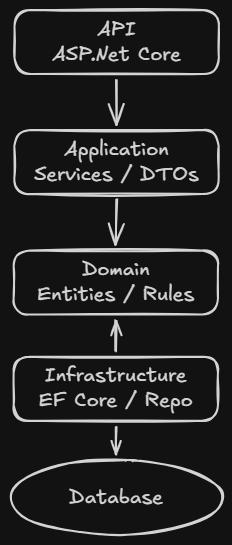

# SystemTask

API REST para gerenciamento de tarefas, construída em .NET 8 seguindo os princípios de **Clean Architecture**.

Projeto de estudo focado em separação de camadas, testes automatizados e boas práticas de organização de código.

## Tecnologias

- .NET 8 / ASP.NET Core
- Entity Framework Core + SQLite
- Swagger (Swashbuckle)
- xUnit
- GitHub Actions (CI)

## Arquitetura

O projeto é dividido em 4 camadas, cada uma com seu próprio projeto de testes:



A regra é simples: `Api` depende de `Application`, que depende de `Domain`. A `Infrastructure` implementa as interfaces definidas no `Application`, sem que as camadas de cima conheçam os detalhes de persistência.

## Funcionalidades

A `TaskItem` (tarefa) possui um ciclo de vida com os status `Pending`, `InProgress`, `OnHold`, `Completed` e `Cancelled`, e as transições entre eles são validadas dentro da própria entidade.

Endpoints disponíveis:

| Método | Rota                        | Descrição                     |
|--------|-----------------------------|--------------------------------|
| POST   | `/api/taskitem/create`      | Cria uma nova tarefa           |
| GET    | `/api/taskitem/{id}`        | Busca uma tarefa por id        |
| GET    | `/api/taskitem/status/{status}` | Busca tarefas por status   |
| PUT    | `/api/taskitem/{id}/start`  | Inicia a tarefa                |
| PUT    | `/api/taskitem/{id}/on-hold`| Coloca a tarefa em espera      |
| PUT    | `/api/taskitem/{id}/complete`| Conclui a tarefa              |
| PUT    | `/api/taskitem/{id}/cancel` | Cancela a tarefa               |

## Como rodar

```bash
git clone https://github.com/Wessh/SystemTask.git
cd SystemTask
dotnet restore
dotnet run --project Api
```

A API sobe com Swagger habilitado em ambiente de desenvolvimento — acesse `/swagger` para testar os endpoints.

## Rodando os testes

```bash
dotnet test
```

Cada camada (`Domain`, `Application`, `Infrastructure`, `Api`) tem sua própria suíte de testes, incluindo testes de integração da API.

## CI

O repositório tem um workflow no GitHub Actions que roda build e testes automaticamente a cada push/PR nas branches de feature.